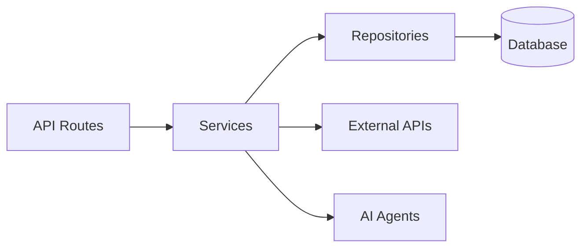
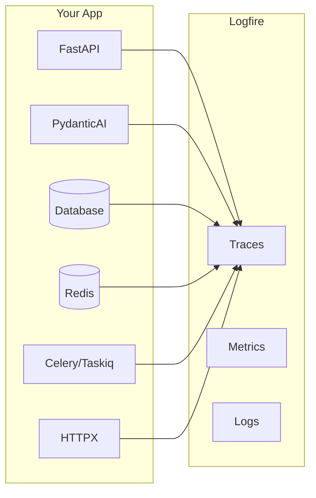

### ⚡ Backend (FastAPI)

- **[FastAPI](https://fastapi.tiangolo.com)** + **[Pydantic v2](https://docs.pydantic.dev)** - High-performance async API
- **Multiple Databases** - PostgreSQL (async), MongoDB (async), SQLite
- **Authentication** - JWT + Refresh tokens, API Keys, OAuth2 (Google)
- **Background Tasks** - Celery, Taskiq, or ARQ
- **Django-style CLI** - Custom management commands with auto-discovery

### Using the Project CLI

Each generated project includes a CLI tool named `vistaai`. Run commands from the `backend/` directory:

```bash
cd backend

# Server commands
uv run vistaai server run --reload     # Start dev server
uv run vistaai server routes           # Show all routes
# Database commands
uv run vistaai db migrate -m "message" # Create migration
uv run vistaai db upgrade              # Apply migrations
uv run vistaai db downgrade            # Rollback migration
# User commands
uv run vistaai user create-admin       # Create admin user
uv run vistaai user create             # Create regular user
uv run vistaai user list               # List all users
```

Or use Makefile shortcuts from the project root:

```bash
make help          # Show all available commands
make run           # Start dev server
make db-migrate    # Create new migration
make db-upgrade    # Apply migrations
make create-admin  # Create admin user
```

**Access:**
- API: http://localhost:8000
- Docs: http://localhost:8000/docs
- Admin Panel: http://localhost:8000/admin
- Frontend: http://localhost:3000

---

## 📸 Screenshots

### Chat Interface
| Light Mode | Dark Mode |
|:---:|:---:|
|  |  |

### Authentication
| Register | Login |
|:---:|:---:|
|  |  |

### Observability
| Logfire (PydanticAI) | LangSmith (LangChain) |
|:---:|:---:|
|  |  |

### Admin, Monitoring & API
| Celery Flower | SQLAdmin Panel |
|:---:|:---:|
|  |  |

| API Documentation |
|:---:|
|  |

---

## 🏗️ Architecture

```mermaid

    subgraph Backend["Backend (FastAPI)"]
        API[API Routes]
        Services[Services Layer]
        Repos[Repositories]
        Agent[AI Agent]
    end

    subgraph Infrastructure
        DB[(PostgreSQL/MongoDB)]
        Redis[(Redis)]
        Queue[Celery/Taskiq]
    end

    subgraph External
        LLM[OpenAI/Anthropic]
        Webhook[Webhook Endpoints]
    end

    UI --> API
    WS <--> Agent
    API --> Services
    Services --> Repos
    Services --> Agent
    Repos --> DB
    Agent --> LLM
    Services --> Redis
    Services --> Queue
    Services --> Webhook
```

### Layered Architecture

The backend follows a clean **Repository + Service** pattern:



| Layer | Responsibility |
|-------|---------------|
| **Routes** | HTTP handling, validation, auth |
| **Services** | Business logic, orchestration |
| **Repositories** | Data access, queries |


### WebSocket Streaming

Both frameworks use the same WebSocket endpoint with real-time streaming:

```python
@router.websocket("/ws")
async def agent_ws(websocket: WebSocket):
    await websocket.accept()

    # Works with both PydanticAI and LangChain
    async for event in agent.stream(user_input):
        await websocket.send_json({
            "type": "text_delta",
            "content": event.content
        })
```


See [AI Agent Documentation](https://github.com/vstorm-co/full-stack-fastapi-nextjs-llm-template/blob/main/docs/ai-agent.md) for more.

---

## 📊 Observability

### Logfire (for PydanticAI)

[Logfire](https://logfire.pydantic.dev) provides complete observability for your application - from AI agents to database queries. Built by the Pydantic team, it offers first-class support for the entire Python ecosystem.




### Usage

```python
# Automatic instrumentation in app/main.py
import logfire

logfire.configure()
logfire.instrument_fastapi(app)
logfire.instrument_asyncpg()
logfire.instrument_redis()
logfire.instrument_httpx()
```

```python
# Manual spans for custom logic
with logfire.span("process_order", order_id=order.id):
    await validate_order(order)
    await charge_payment(order)
    await send_confirmation(order)
```

For more details, see [Logfire Documentation](https://logfire.pydantic.dev/docs/integrations/).

---

## 📈 Prometheus Metrics

This project includes Prometheus metrics for monitoring and alerting.

### Accessing Metrics

Metrics are exposed at the `/metrics` endpoint:

```bash
curl http://localhost:8000/metrics
```

### Available Metrics

| Metric | Type | Description |
|--------|------|-------------|
| `http_requests_total` | Counter | Total HTTP requests by method, path, status |
| `http_request_duration_seconds` | Histogram | Request latency distribution |
| `http_requests_inprogress` | Gauge | Currently in-flight requests |
| `http_request_size_bytes` | Histogram | Request body size |
| `http_response_size_bytes` | Histogram | Response body size |

### Prometheus Configuration

Add to your `prometheus.yml`:

```yaml
scrape_configs:
  - job_name: 'vistaai'
    static_configs:
      - targets: ['localhost:8000']
    metrics_path: /metrics
    scrape_interval: 15s
```

### Docker Labels

When running with Docker, the service includes labels for Prometheus service discovery:

```yaml
labels:
  - "prometheus.scrape=true"
  - "prometheus.port=8000"
  - "prometheus.path=/metrics"
```

### Environment Variables

| Variable | Default | Description |
|----------|---------|-------------|
| `PROMETHEUS_METRICS_PATH` | `/metrics` | Endpoint path for metrics |
| `PROMETHEUS_INCLUDE_IN_SCHEMA` | `false` | Include in OpenAPI schema |

---

## ☸️ Kubernetes Deployment

This project includes Kubernetes manifests for production deployment.

### Quick Deploy

```bash
# Using kustomize (recommended)
kubectl apply -k kubernetes/

# Or apply individually
kubectl apply -f kubernetes/namespace.yaml
kubectl apply -f kubernetes/configmap.yaml
kubectl apply -f kubernetes/secret.yaml
kubectl apply -f kubernetes/deployment.yaml
kubectl apply -f kubernetes/service.yaml
kubectl apply -f kubernetes/ingress.yaml
```

### Manifest Files

| File | Description |
|------|-------------|
| `namespace.yaml` | Creates dedicated namespace |
| `configmap.yaml` | Non-sensitive configuration |
| `secret.yaml` | Sensitive data (passwords, API keys) |
| `deployment.yaml` | Backend + worker deployments |
| `service.yaml` | ClusterIP service for backend |
| `ingress.yaml` | External access with nginx ingress |
| `kustomization.yaml` | Kustomize configuration |

### Before Deploying

1. **Update secrets** in `kubernetes/secret.yaml`:
   ```bash
   # Generate a secure SECRET_KEY
   openssl rand -hex 32
   ```

2. **Configure ingress** in `kubernetes/ingress.yaml`:
   - Replace `api.example.com` with your domain
   - Uncomment TLS section for HTTPS

3. **Build and push Docker image**:
   ```bash
   docker build -t your-registry/vistaai:latest ./backend
   docker push your-registry/vistaai:latest
   ```

4. **Update image** in `kubernetes/kustomization.yaml`:
   ```yaml
   images:
     - name: vistaai
       newName: your-registry/vistaai
       newTag: latest
   ```

### Scaling

```bash
# Scale backend replicas
kubectl scale deployment vistaai-backend -n vistaai --replicas=3

# View pods
kubectl get pods -n vistaai

# View logs
kubectl logs -f deployment/vistaai-backend -n vistaai
```

### Using with Helm (optional)

For more advanced deployments, consider creating a Helm chart based on these manifests.

---

## 🛠️ Django-style CLI

Each generated project includes a powerful CLI inspired by Django's management commands. The CLI name matches your project slug (e.g., if your project is `my_app`, the CLI command is `uv run my_app`).

### Built-in Commands

```bash
# Run commands from the backend directory:
cd backend

# Server
uv run vistaai server run --reload
uv run vistaai server routes

# Database (Alembic wrapper)
uv run vistaai db init
uv run vistaai db migrate -m "Add users"
uv run vistaai db upgrade

# Users
uv run vistaai user create-admin       # Create admin (interactive)
uv run vistaai user create             # Create user (interactive)
uv run vistaai user list               # List all users
```

> **Tip:** Use `make` commands as shortcuts - they handle the `uv run` prefix and directory automatically. Run `make help` to see all available commands.

### Custom Commands

Create your own commands with auto-discovery:

```python
# app/commands/seed.py
from app.commands import command, success, error
import click

@command("seed", help="Seed database with test data")
@click.option("--count", "-c", default=10, type=int)
@click.option("--dry-run", is_flag=True)
def seed_database(count: int, dry_run: bool):
    """Seed the database with sample data."""
    if dry_run:
        info(f"[DRY RUN] Would create {count} records")
        return

    # Your logic here
    success(f"Created {count} records!")
```

Commands are **automatically discovered** from `app/commands/` - just create a file and use the `@command` decorator.

```bash
uv run vistaai cmd seed --count 100
uv run vistaai cmd seed --dry-run
```

---

## 🖥️ Manual Commands Reference (Windows / No Make)

If you don't have `make` installed (common on Windows), use these commands directly.
All commands should be run from the project root directory.

### Setup & Development

| Task | Command |
|------|---------|
| Install dependencies | `uv sync --directory backend --dev` |
| Start dev server | `uv run --directory backend vistaai server run --reload` |
| Start prod server | `uv run --directory backend vistaai server run --host 0.0.0.0 --port 8000` |
| Show routes | `uv run --directory backend vistaai server routes` |

### Code Quality

| Task | Command |
|------|---------|
| Format code | `uv run --directory backend ruff format app tests cli` |
| Fix lint issues | `uv run --directory backend ruff check app tests cli --fix` |
| Check linting | `uv run --directory backend ruff check app tests cli` |
| Type check | `uv run --directory backend mypy app` |

### Testing

| Task | Command |
|------|---------|
| Run tests | `uv run --directory backend pytest tests/ -v` |
| Run with coverage | `uv run --directory backend pytest tests/ -v --cov=app --cov-report=term-missing` |

### Database

| Task | Command |
|------|---------|
| Create migration | `uv run --directory backend vistaai db migrate -m "message"` |
| Apply migrations | `uv run --directory backend vistaai db upgrade` |
| Rollback migration | `uv run --directory backend vistaai db downgrade` |
| Show current | `uv run --directory backend vistaai db current` |
| Show history | `uv run --directory backend vistaai db history` |

### Users

| Task | Command |
|------|---------|
| Create admin | `uv run --directory backend vistaai user create-admin` |
| Create user | `uv run --directory backend vistaai user create` |
| List users | `uv run --directory backend vistaai user list` |

### Celery

| Task | Command |
|------|---------|
| Start worker | `uv run --directory backend vistaai celery worker` |
| Start beat | `uv run --directory backend vistaai celery beat` |
| Start flower | `uv run --directory backend vistaai celery flower` |

### Docker

| Task | Command |
|------|---------|
| Start all services | `docker-compose up -d` |
| Stop all services | `docker-compose down` |
| View logs | `docker-compose logs -f` |
| Build images | `docker-compose build` |
| Start PostgreSQL only | `docker-compose up -d db` |
| Start Redis only | `docker-compose up -d redis` |
| Start production | `docker-compose -f docker-compose.prod.yml up -d` |

### Cleanup

| Task | Command (Unix) | Command (Windows PowerShell) |
|------|----------------|------------------------------|
| Clean cache | `find . -type d -name __pycache__ -exec rm -rf {} +` | `Get-ChildItem -Recurse -Directory -Filter __pycache__ \| Remove-Item -Recurse -Force` |

---

## 📁 Generated Project Structure

```
my_project/
├── backend/
│   ├── app/
│   │   ├── main.py              # FastAPI app with lifespan
│   │   ├── api/
│   │   │   ├── routes/v1/       # Versioned API endpoints
│   │   │   ├── deps.py          # Dependency injection
│   │   │   └── router.py        # Route aggregation
│   │   ├── core/                # Config, security, middleware
│   │   ├── db/models/           # SQLAlchemy/MongoDB models
│   │   ├── schemas/             # Pydantic schemas
│   │   ├── repositories/        # Data access layer
│   │   ├── services/            # Business logic
│   │   ├── agents/              # AI agents with centralized prompts
│   │   ├── commands/            # Django-style CLI commands
│   │   └── worker/              # Background tasks
│   ├── cli/                     # Project CLI
│   ├── tests/                   # pytest test suite
│   └── alembic/                 # Database migrations
├── frontend/
│   ├── src/
│   │   ├── app/                 # Next.js App Router
│   │   ├── components/          # React components
│   │   ├── hooks/               # useChat, useWebSocket, etc.
│   │   └── stores/              # Zustand state management
│   └── e2e/                     # Playwright tests
├── docker-compose.yml
├── Makefile
└── README.md
```

Generated projects include version metadata in `pyproject.toml` for tracking:

```toml
[tool.fastapi-fullstack]
generator_version = "0.1.5"
generated_at = "2024-12-21T10:30:00+00:00"
```

---

## ⚙️ Configuration Options

### Core Options

| Option | Values | Description |
|--------|--------|-------------|
| **Database** | `postgresql`, `mongodb`, `sqlite`, `none` | Async by default |
| **Auth** | `jwt`, `api_key`, `both`, `none` | JWT includes user management |
| **OAuth** | `none`, `google` | Social login |
| **AI Framework** | `pydantic_ai`, `langchain` | Choose your AI agent framework |
| **LLM Provider** | `openai`, `anthropic`, `openrouter` | OpenRouter only with PydanticAI |
| **Background Tasks** | `none`, `celery`, `taskiq`, `arq` | Distributed queues |

### Presets

| Preset | Description |
|--------|-------------|
| `--preset production` | Full production setup with Redis, Sentry, Kubernetes, Prometheus |
| `--preset ai-agent` | AI agent with WebSocket streaming and conversation persistence |
| `--minimal` | Minimal project with no extras |

### Integrations

Select what you need:

```bash
fastapi-fullstack new
# ✓ Redis (caching/sessions)
# ✓ Rate limiting (slowapi)
# ✓ Pagination (fastapi-pagination)
# ✓ Admin Panel (SQLAdmin)
# ✓ AI Agent (PydanticAI or LangChain)
# ✓ Webhooks
# ✓ Sentry
# ✓ Logfire / LangSmith
# ✓ Prometheus
# ... and more
```

---

## 📚 Documentation

| Document | Description |
|----------|-------------|
| [Architecture](https://github.com/vstorm-co/full-stack-fastapi-nextjs-llm-template/blob/main/docs/architecture.md) | Repository + Service pattern, layered design |
| [Observability](https://github.com/vstorm-co/full-stack-fastapi-nextjs-llm-template/blob/main/docs/observability.md) | Logfire integration, tracing, metrics |
| [Deployment](https://github.com/vstorm-co/full-stack-fastapi-nextjs-llm-template/blob/main/docs/deployment.md) | Docker, Kubernetes, production setup |
| [Development](https://github.com/vstorm-co/full-stack-fastapi-nextjs-llm-template/blob/main/docs/development.md) | Local setup, testing, debugging |

---
